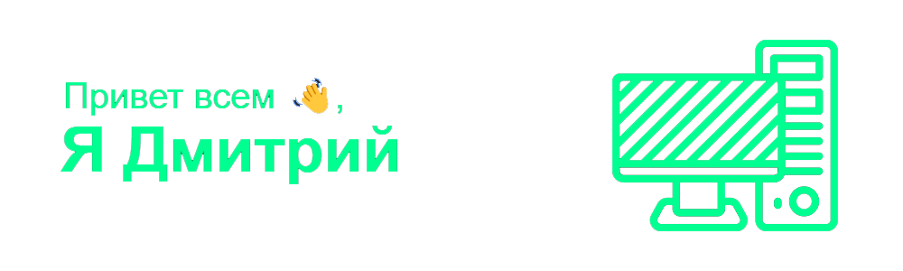
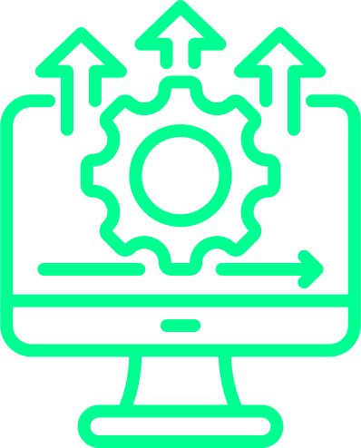
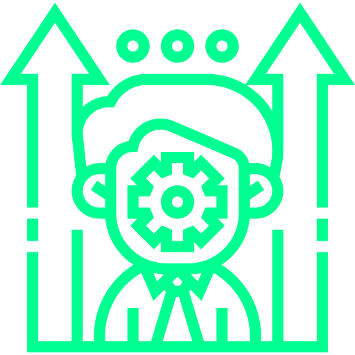

#  About Me
Я Фронтент-разработчик из России

*  Я люблю создавать и улучшать пользовательские интерфейсы, которые сочетают в себе красоту и функциональность.

*  В моем портфолио вы найдете проекты, над которыми я уделял особое внимание деталям и оптимизации, чтобы обеспечить наилучший пользовательский опыт. [Вот моё резюме](https://hh.ru/resume/dfd3705fff0d0c0e2a0039ed1f4d764b41755a)

*  Стремлюсь постоянно повышать свои навыки и расширять свой технологический стек, чтобы быть в курсе последних тенденций во фронтенд-разработке.

*  Я активно ищу работу в дружной и креативной команде, где смогу внести свой вклад и учиться у опытных коллег.

---

# Languages and Tools

        

---
<h1 align="center"> My contacts</h1>

&ensp;<a href="mailto:dmitry29.petrov@yandex.ru"> dmitry29.petrov@yandex.ru</a>

<a href="mailto:https://t.me/DPetrovsky24"> https://t.me/DPetrovsky24</a>
